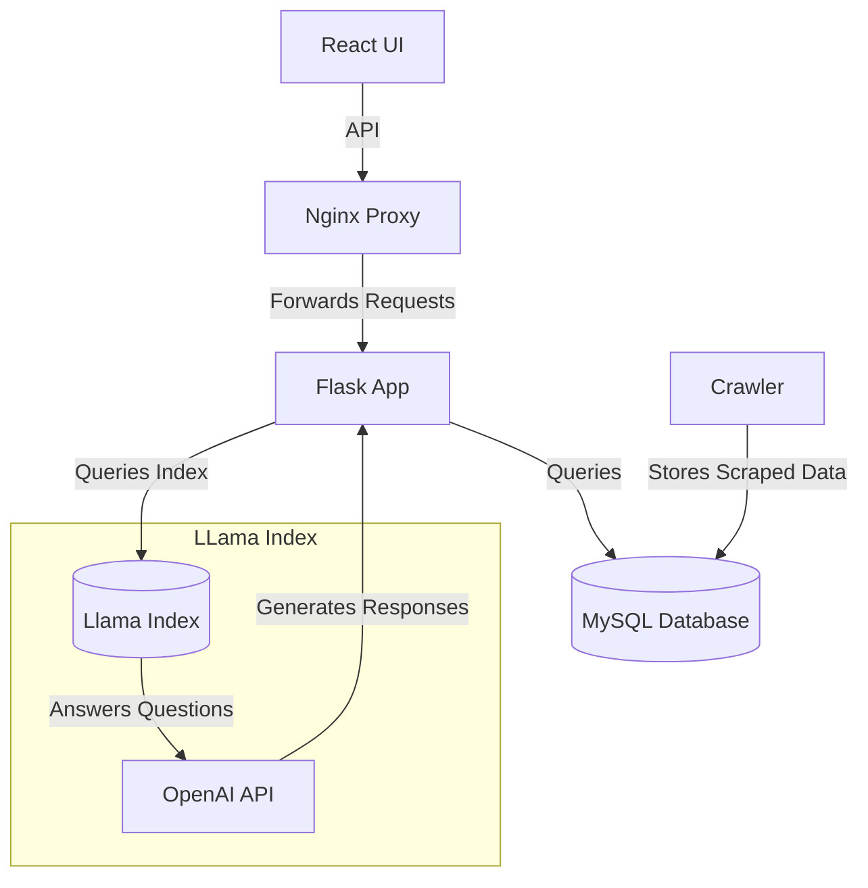
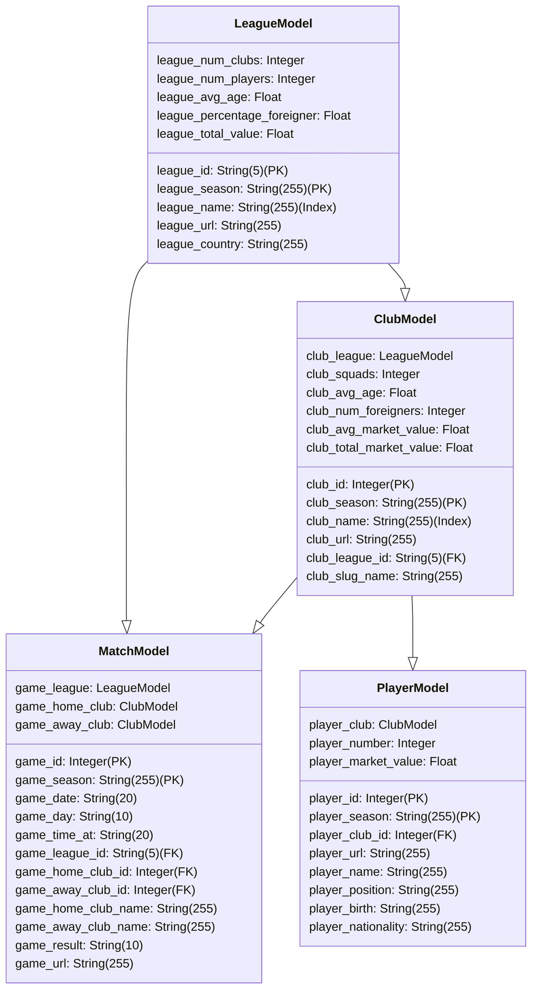

# Football Teller App

Welcome to the Football Teller app! This application provides information about football leagues, clubs, matches, and players.

## Architecture

The app follows the following architecture:



## Data Models

Here are the data models used in the app:



## Getting Started

To run the app, use the provided `docker-compose.yml` file and `Makefile`:

### Prerequisites

- Docker
- Docker Compose

### Setup

1. Clone this repository.
2. Create a `dev.env` file with necessary environment variables.
3. Run the following command to start the app:

   ```sh
   make install  # Install dependencies
   make test     # Run tests
   ```

### Docker Compose

The app can be deployed using Docker Compose:

1. Edit the dev.env file with your configuration, including OPENAI_API_KEY.

2. Run the following command to start the app:

   ```sh
   docker-compose up
   ```

## Contributing

Contributions are welcome! Feel free to submit issues and pull requests.

## License

This project is licensed under the [MIT License](LICENSE).
```

You can copy and paste this markdown into your `README.md` file. Please make sure to adjust any placeholders like project names, descriptions, and paths to fit your actual project structure.